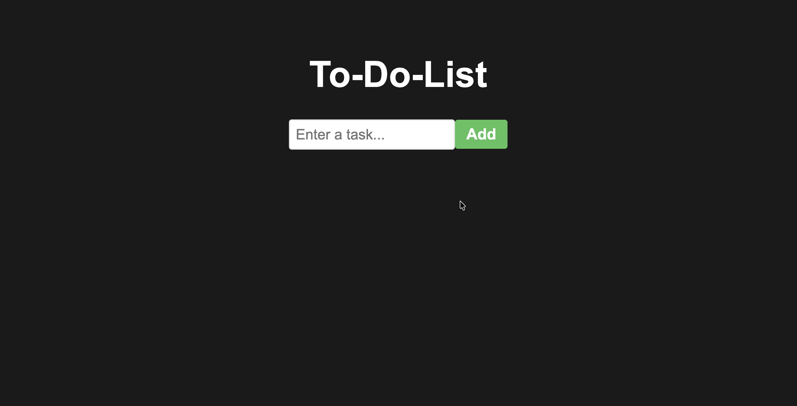
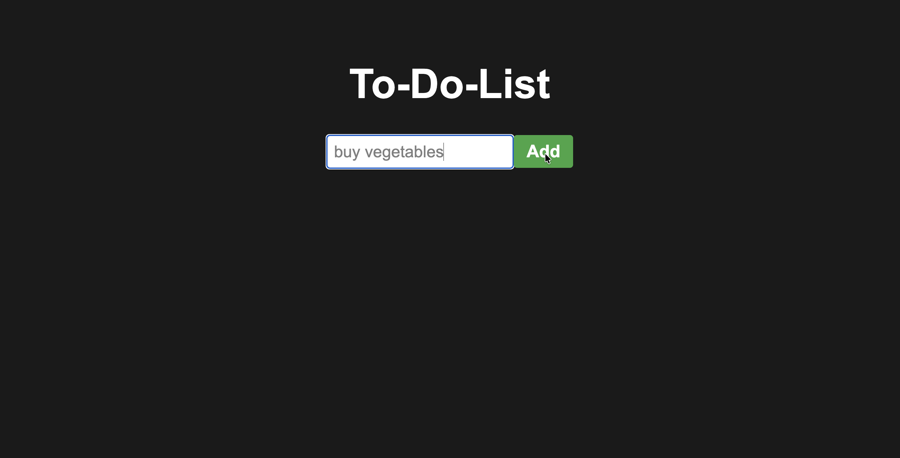
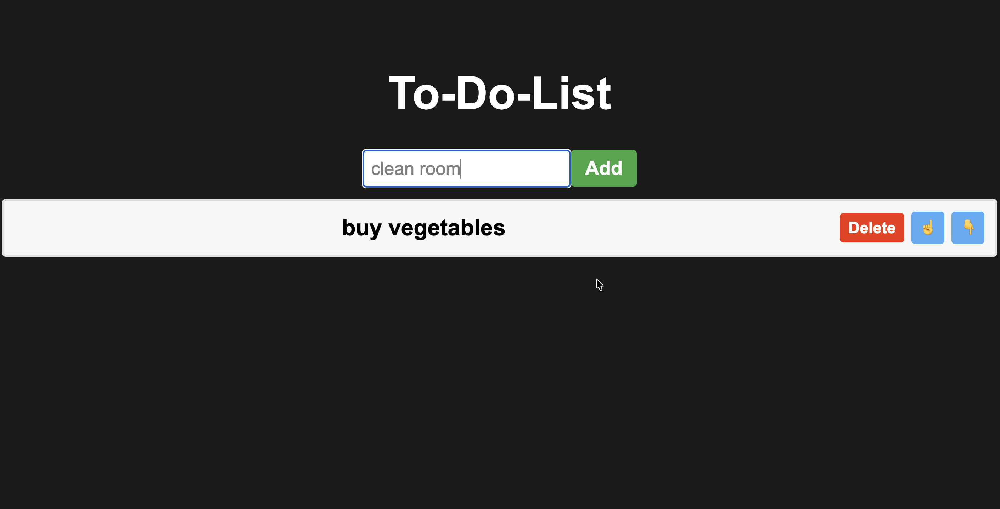
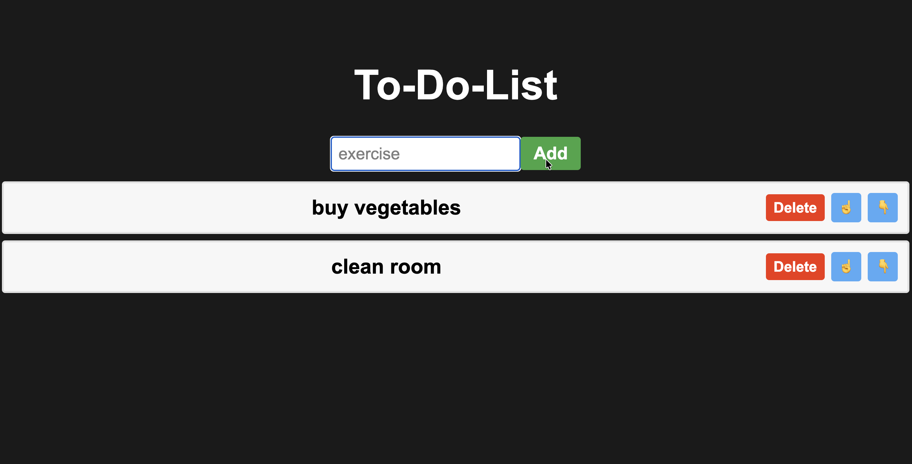
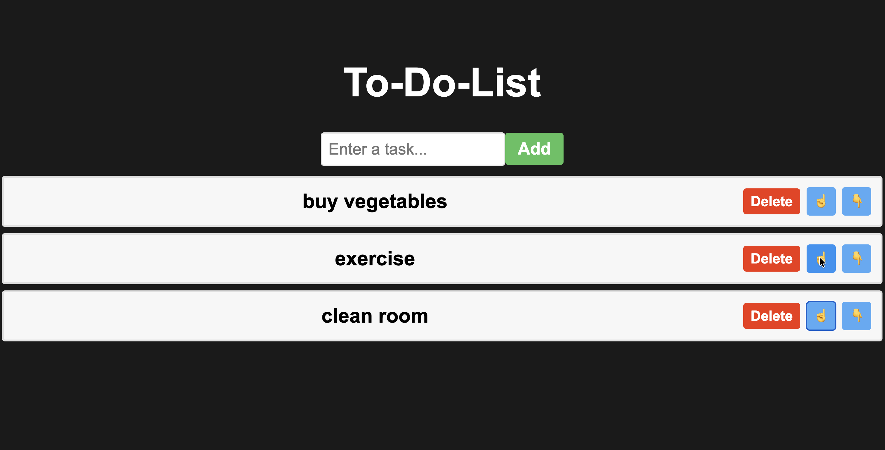
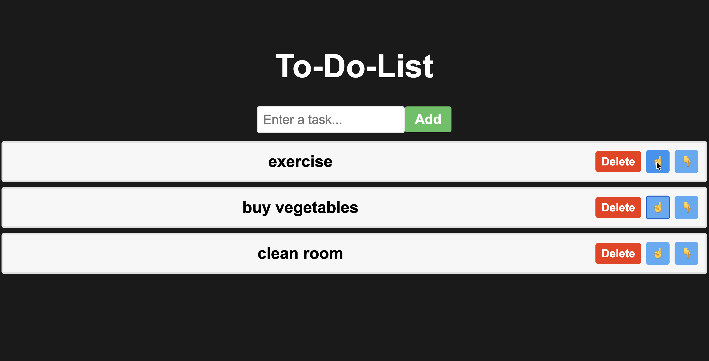

# To-Do List Website Demo
This is a Nextjs website for a class presentation on how to make a basic local website. Source code is from YouTube. Demonstrative purposes only.
# Steps
1. Clone repo to your machine via SSH or HTTPS
```zsh
git clone git@github.com:TrueMarcoM/build-a-website-demo.git
```
OR
```zsh
git clone https://github.com/TrueMarcoM/build-a-website-demo.git
```

2. Navigate to `my-app` directory
```zsh
cd build-a-website-demo/my-app
npm install
```

3. Install dependencies
```zsh
npm install
```

4. Run the local server
```zsh
npm run dev
```

5. Paste this URL into your browser search bar and press enter
```zsh
localhost:3000
```
# Gallery











